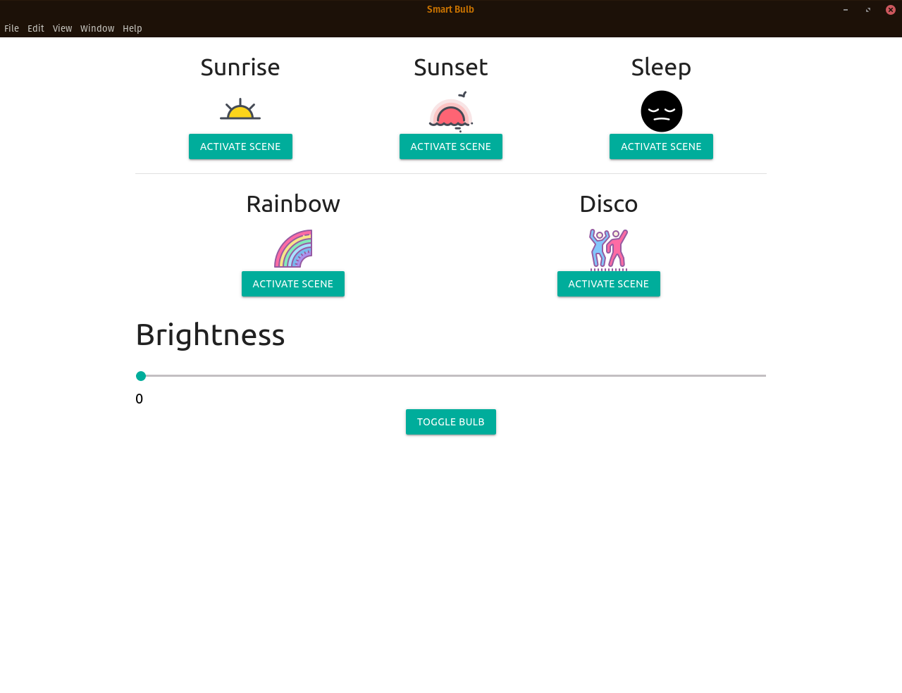

# Smart Bulb

## What is Smart Bulb

Smart Bulb is a UI wrapper for [yeelight-shell-scipts](https://github.com/hphde/yeelight-shell-scripts)

It cannot work if `yeelight-shell-scripts` are not available and configured

## What has been implemented
The following actions can be performed from the UI
* Bulb toggle
* Brightness control
* Scenes

This is the first version
There are many things supported by `yeelight-shell-scripts` than need to be implemented

## How to start it

After cloning run `npm start` to start the application

You can also build a `deb` file by running `npm run make`

## Icons

Icons used in this project can be found on [icons8](https://icons8.com/)
